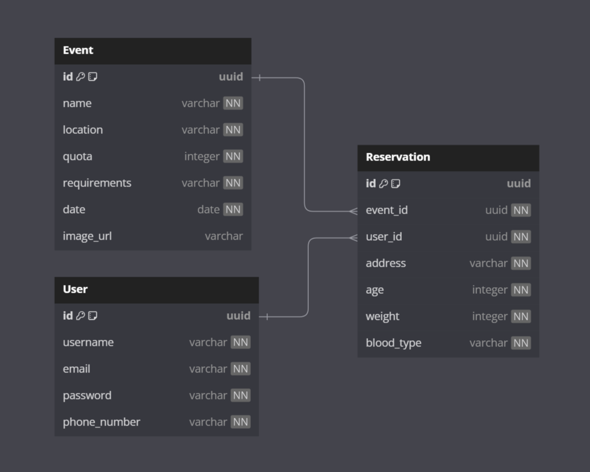

# blood-nation-backend
BloodNation is an application designed to facilitate blood donation by helping users find locations for blood donation events and make reservations to participate in these events.

## Installation
1. Clone this repository
```bash
 git clone https://github.com/thecourtstats/court-app.git
```

2. Get all dependencies
```bash
 npm install
```

3. Run the application
```bash
 npm run start
```

## Documentation
The documentation is available on [Blood Nation API Docs](https://documenter.getpostman.com/view/31622292/2sA35LVfHq).

## ERD
This is the **Entity Relationship Diagram** of Blood Nation App.


</br>
</br>

**Application sequelize cli** :
1. `npm init -y`
2. `npx sequelize init`
3. `npx sequelize db:create`
4. `npx sequelize model:generate --name <table-name> --attributes <field>:<data-type>,<field>:<data-type>...`
5. `npx sequelize db:migrate`
/ `npx sequelize db:migrate:undo --name <migration--name>`
6. `npx sequelize seed:generate --name <file-name>`
7. `npx sequelize db:seed --seed <seeders-name>`
/ `npx sequelize db:seed:undo --seed <seeders-name>`